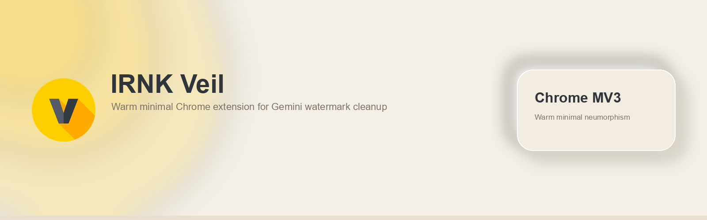
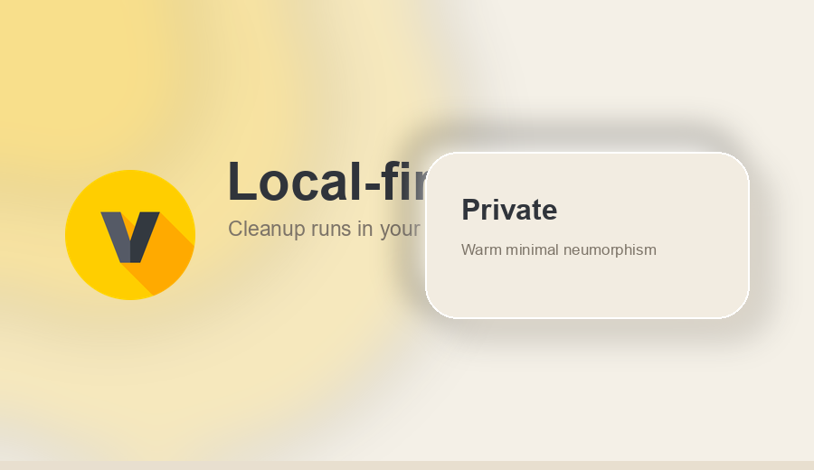
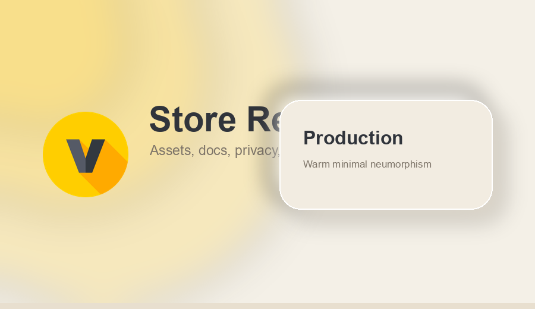

# IRNK Veil: Gemini Watermark Cleaner



IRNK Veil is a Chrome Manifest V3 extension by **IRNK Codes** for cleaning Gemini image watermarks locally in the browser.

> [!IMPORTANT]
> IRNK Veil is an independent tool by IRNK Codes. It is not affiliated with, endorsed by, or sponsored by Google or Gemini.

## Highlights

- **Local-first processing**: image cleanup runs in the browser.
- **Gemini-focused workflow**: scoped to supported Gemini pages and related image resources.
- **Minimal permissions**: host permissions are limited to the cleanup workflow.
- **Modern popup UI**: minimal neumorphism interface aligned with the IRNK Veil brand.
- **Production build**: powered by Vite and Chrome Manifest V3.

## Visual Preview

| Local-first | Minimal UI | Store-ready |
|---|---|---|
|  |  |  |

## Privacy Model

IRNK Veil is designed around local processing:

- images are processed in the browser,
- image data is not uploaded to IRNK Codes servers,
- settings and statistics are stored in Chrome local storage,
- no analytics SDK is included by default.

See [PRIVACY.md](./PRIVACY.md) for details.

## Chrome Web Store Assets

Generated visual assets are available in:

- [assets/store/screenshots](./assets/store/screenshots)
- [assets/store/promotional](./assets/store/promotional)
- [assets/store/icons](./assets/store/icons)
- [assets/ASSET_MANIFEST.md](./assets/ASSET_MANIFEST.md)

## Development

### Requirements

- Node.js `v26.2.0`
- npm
- Google Chrome or a Chromium-based browser

### Install

```bash
npm install
```

### Validate

```bash
npm run lint
npm run typecheck
npm run build
```

### Development Server

```bash
npm run dev
```

### Production Build

```bash
npm run build
```

The production extension output is generated in:

```text
dist/
```

Load this folder as an unpacked extension from `chrome://extensions/` during manual testing.

## Chrome Web Store Packaging

For Chrome Web Store upload, zip the **contents** of `dist/`, not the parent `dist` folder.

Correct ZIP root:

```text
manifest.json
service-worker-loader.js
assets/
icon/
rules/
src/
```

See [docs/CHROME_WEB_STORE.md](./docs/CHROME_WEB_STORE.md) for the full upload checklist.

## Project Structure

```text
src/
├── background/       # MV3 service worker source
├── build/            # build orchestration
├── popup/            # React popup UI
└── runtime/          # content/runtime modules

public/
├── icon/             # extension icons
└── rules/            # declarativeNetRequest rules

docs/                 # production and store documentation
assets/               # GitHub and Chrome Web Store visual assets
```

## Core Commands

| Command | Purpose |
|---|---|
| `npm run lint` | Run ESLint |
| `npm run typecheck` | Run TypeScript checks |
| `npm run build` | Build production extension |
| `npm run check` | Run typecheck and lint |

## Documentation

- [Chrome Web Store Guide](./docs/CHROME_WEB_STORE.md)
- [Technical Reference](./docs/TECHNICAL_REFERENCE.md)
- [Privacy Policy](./PRIVACY.md)
- [Security Policy](./SECURITY.md)
- [Contributing Guide](./CONTRIBUTING.md)
- [Changelog](./CHANGELOG.md)

## License

Copyright © 2026 IRNK Codes. All rights reserved.

See [LICENSE](./LICENSE).
